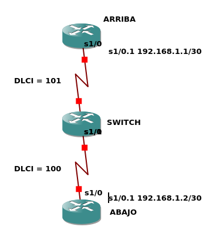

# Ejercicio Frame Relay
Se conectan los routers como se muestran en la siguiente figura



Se separan las interfaces en subinterfaces lógicas para poder comunicarme con distintas redes a través la misma interfaz física. En cada subinterfaz voy a tener una IP y un DLCI.

***Defino tantas subinterfaces lógicas como DLCI tengo***
## Configuración Router ARRIBA
```
ARRIBA#config t
ARRIBA(config)#int s1/0
ARRIBA(config-if)#clock rate 64000
ARRIBA(config-if)#encapsulation frame-relay ietf
ARRIBA(config-if)#frame-relay intf-type dte
ARRIBA(config-if)#no shutdown
ARRIBA(config-if)#exit

ARRIBA(config)#int s1/0.1 point-to-point
ARRIBA(config-subif)#ip address 192.168.1.1 255.255.255.252
ARRIBA(config-subif)#frame-relay interface-dlci 101
ARRIBA(config-fr-dlci)#exit
ARRIBA(config-subif)#exit

ARRIBA(config)#line vty 0 4
ARRIBA(config-line)#password uca
ARRIBA(config-line)#transport input all
ARRIBA(config-line)#login
ARRIBA(config-line)#exit
ARRIBA(config)#exit

ARRIBA#write
```
## Configuración Router SWITCH
```
SWITCH#config t
SWITCH(config)#frame-relay switching 
SWITCH(config)#int s1/0
SWITCH(config-if)#encapsulation frame-relay ietf
SWITCH(config-if)#frame-relay intf-type dce 
SWITCH(config-if)#frame-relay route 101 interface s1/1 100
SWITCH(config-if)#clock rate 64000
SWITCH(config-if)#no shutdown 
SWITCH(config-if)#exit

SWITCH(config)#int s1/1
SWITCH(config-if)#encapsulation frame-relay ietf
SWITCH(config-if)#frame-relay intf-type dce 
SWITCH(config-if)#frame-relay route 100 interface s1/0 101
SWITCH(config-if)#clock rate 64000
SWITCH(config-if)#no shutdown 
SWITCH(config-if)#exit
SWITCH(config)#exit

SWITCH#write
```
## Configuración Router ABAJO
```
ABAJO(config)#int s1/0
ABAJO(config-if)#clock rate 64000
ABAJO(config-if)#encapsulation frame-relay ietf
ABAJO(config-if)#frame-relay intf-type dte
ABAJO(config-if)#no shutdown
ABAJO(config-if)#exit

ABAJO(config)#int s1/0.1 point-to-point
ABAJO(config-subif)#ip address 192.168.1.2 255.255.255.252
ABAJO(config-subif)#frame-relay interface-dlci 100
ABAJO(config-fr-dlci)#exit
ABAJO(config-subif)#exit

ABAJO(config)#line vty 0 4
ABAJO(config-line)#password uca
ABAJO(config-line)#transport input all
ABAJO(config-line)#login
ABAJO(config-line)#exit
ABAJO(config)#exit

ABAJO#write
```