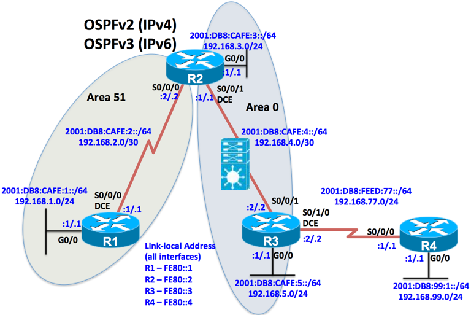

# Ejercicio OSPF
## Topología


Por la topología, R1 es un router en area stub, R2 es ABR, R3 es un ASBR y R4 es un router externo al AS OSPF.

## Preconfiguraciones
### Router 1
```
Gateway of last resort is not set

      192.168.1.0/24 is variably subnetted, 2 subnets, 2 masks
C        192.168.1.0/24 is directly connected, Loopback0
L        192.168.1.1/32 is directly connected, Loopback0
```
### Router 2
```
Gateway of last resort is not set

      192.168.3.0/24 is variably subnetted, 2 subnets, 2 masks
C        192.168.3.0/24 is directly connected, Loopback0
L        192.168.3.1/32 is directly connected, Loopback0
```
### Router 3
```
Gateway of last resort is not set

      192.168.5.0/24 is variably subnetted, 2 subnets, 2 masks
C        192.168.5.0/24 is directly connected, Loopback0
L        192.168.5.1/32 is directly connected, Loopback0
```
### Router 4
```
Gateway of last resort is not set

      192.168.99.0/24 is variably subnetted, 2 subnets, 2 masks
C        192.168.99.0/24 is directly connected, Loopback0
L        192.168.99.1/32 is directly connected, Loopback0
```

## Configuración OSPF
### Router 1
```
R1#config t
R1(config)#router ospf 100
R1(config-router)#router-id 1.1.1.1
R1(config-router)#network 0.0.0.0 255.255.255.255 area 51
R1(config-router)#do clear ip ospf process
R1(config-router)#exit

R1(config)#int g1/0
R1(config-if)#ip ospf network point-to-point
```
### Router 2
```
R2#config t
R2(config)#router ospf 200
R2(config-router)#router-id 2.2.2.2
R2(config-router)#network 192.168.2.0 0.0.0.3 area 51
R2(config-router)#network 192.168.3.0 0.0.0.255 area 0
R2(config-router)#network 192.168.4.0 0.0.0.3 area 0
R2(config-router)#do clear ip ospf process
R2(config-router)#exit

R2(config)#int g1/0
R2(config-if)#ip address 192.168.4.1 255.255.255.252
R2(config-if)#ip ospf network point-to-point
R2(config-if)#exit

R2(config)#int f0/0
R2(config-if)#ip ospf network point-to-point
```
### Router 3
```
R3(config)#ip route 0.0.0.0 0.0.0.0 192.168.77.1
R3(config)#router ospf 300
#router-id 3.3.3.3
R3(config-router)#network 192.168.4.0 0.0.0.3 area 0
R3(config-router)#network 192.168.5.0 0.0.0.255 area 0
R3(config-router)#default-information originate 
R3(config-router)#exit
 
R3(config)#int f0/0 
R3(config-if)#ip ospf network point-to-point

```

### Router 4
```
R4#config t
R4(config)#ip route 192.168.0.0 255.255.248.0 192.168.77.2
```