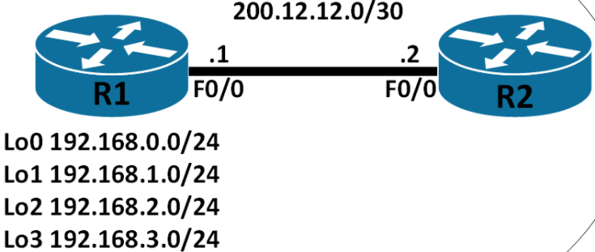
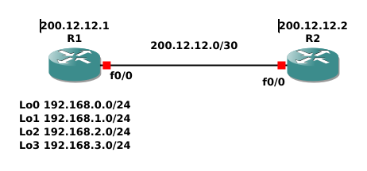

# Ejercicio Enrutamiento Estático

>**Si sumarizamos las ip de las interfaces lógicas, ¿cuál es la red equivalente?**
>
>***Rta:*** 192.168.0.0/22

>**¿Cómo seria la ruta estática configurada en R2 para que llegar a todas las loopback?**
>
>***Rta:*** ip route 192.168.0.0 255.255.252.0 200.12.12.0

> **¿R1 necesita una ruta estática para llegar a R2?**
>
>***Rta:*** No, porque se encuentran directamente conectados y sus interfaces están levantadas. No hay un salto (hop) intermedio

>**Montar dicha topología y configurar las ip correspondientes y la ruta estática, verificar la conexión.**
>
>***Rta:***
> ###### Topología en GNS3

> ##### Configuración R1
>```
>R1#config t
>
>R1(config)#int f0/0
>R1(config-if)#ip address 200.12.12.1 255.255.255.252
>R1(config-if)#no shutdown
>R1(config-if)#exit
>
>R1(config)#int loopback 0  
>R1(config-if)#ip address 192.168.0.1 255.255.255.0
>R1(config-if)#exit
>
>R1(config)#int loopback 1
>R1(config-if)#ip address 192.168.1.1 255.255.255.0
>R1(config-if)#exit
>
>R1(config)#int loopback 2
>R1(config-if)#ip address 192.168.2.1 255.255.255.0
>
>R1(config)#int loopback 3
>R1(config-if)#ip address 192.168.3.1 255.255.255.0
>R1(config-if)#exit
>
>R1(config)#exit
>
>R1#write
>```
> ##### Tabla de ruteo R1
>```
>Gateway of last resort is not set
>      192.168.0.0/24 is variably subnetted, 2 subnets, 2 masks
>C        192.168.0.0/24 is directly connected, Loopback0
>L        192.168.0.1/32 is directly connected, Loopback0
>      192.168.1.0/24 is variably subnetted, 2 subnets, 2 masks
>C        192.168.1.0/24 is directly connected, Loopback1
>L        192.168.1.1/32 is directly connected, Loopback1
>      192.168.2.0/24 is variably subnetted, 2 subnets, 2 masks
>C        192.168.2.0/24 is directly connected, Loopback2
>L        192.168.2.1/32 is directly connected, Loopback2
>      192.168.3.0/24 is variably subnetted, 2 subnets, 2 masks
>C        192.168.3.0/24 is directly connected, Loopback3
>200.12.12.0/24 is variably subnetted, 2 subnets, 2 masks
>C        200.12.12.0/30 is directly connected, FastEthernet0/0
>L        200.12.12.1/32 is directly connected, FastEthernet0/0
>```
>No ve a R2 (200.12.12.2) especificamente pero sabe que si tiene tiene que mandar el paquete por FastEthernet0/0 si la dirección de destino es de la red 200.12.12.0/30, a la cual R2 va a pertenecer una vez configurado.
>##### Configuración R2
>```
>R2#config t
>R2(config)#int fa0/0
>R2(config-if)#ip address 200.12.12.2 255.255.255.252
>R2(config-if)#no shutdown
>R2(config-if)#exit
>
>R2(config)#exit
>```
>##### Tabla de ruteo R2 antes del enrutamiento estático
>```
>Gateway of last resort is not set
>      200.12.12.0/24 is variably subnetted, 2 subnets, 2 masks
>C        200.12.12.0/30 is directly connected, FastEthernet0/0
>L        200.12.12.2/32 is directly connected, FastEthernet0/0
>```
>##### Ping de prueba R2 → R1
>```
>R2#ping 200.12.12.1
>Type escape sequence to abort.
>Sending 5, 100-byte ICMP Echos to 200.12.12.1, timeout is 2 seconds:
>.!!!!
>Success rate is 80 percent (4/5), round-trip min/avg/max = 48/48/48 ms
>```
>Todavia no ve las redes a las cuales pertenecen las loopbacks porque es necesario el enrutamiento estático. Puede conectarse con R1 sin necesitar enrutamiento estático.
>##### Enrutamiento estático R2
>```
>R2#config t
>R2(config)#ip route 192.168.0.0 255.255.252.0 200.12.12.1
>```
>##### Tabla de ruteo R2 después del enrutamiento estático
>```
>Gateway of last resort is not set
>S     192.168.0.0/22 [1/0] via 200.12.12.1
>      200.12.12.0/24 is variably subnetted, 2 subnets, 2 masks
>C        200.12.12.0/30 is directly connected, FastEthernet0/0
>L        200.12.12.2/32 is directly connected, FastEthernet0/0
>```
>Ahora R2 sabe que si tiene alcanzar alguna de las cuatro redes, puede hacerlo a través de R1
>#### Ping y trace de prueba R2 → R1.Lo0
>```
>R2#ping 192.168.1.1
>Type escape sequence to abort.
>Sending 5, 100-byte ICMP Echos to 192.168.1.1, timeout is 2 seconds:
>!!!!!
>Success rate is 100 percent (5/5), round-trip min/avg/max = 64/71/80 ms
>R2#trace 192.168.1.1
>Type escape sequence to abort.
>Tracing the route to 192.168.1.1
>VRF info: (vrf in name/id, vrf out name/id)
>  1 200.12.12.1 64 msec 48 msec 48 msec
>```
